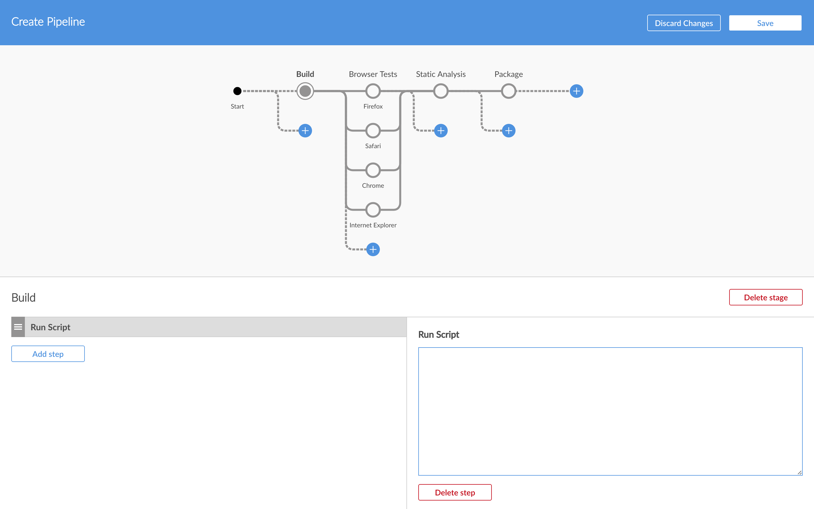

# Blue Ocean Pipeline Editor

This repository houses the [Jenkins](https://jenkins.io/) plugin for creating and editing Pipeline jobs within the [Blue Ocean](https://jenkins.io/projects/blueocean/) user interface.



:exclamation: **Important!** This software is a work-in-progress and is not complete.

## Running Locally

To start a new jenkins and run this pluging for development purposes:

```
# Start a local Jenkins
mvn hpi:run
```

And in another term,
```
# Watch and build the JS
npm run bundle:watch
```

## Running in another development Jenkins Instance

```
# Link this as a plugin into your Blue Ocean Jenkins' hpi:run server
mvn hpi:hpl -DjenkinsHome=<path-to-blueocean-home/blueocean/work>
```
